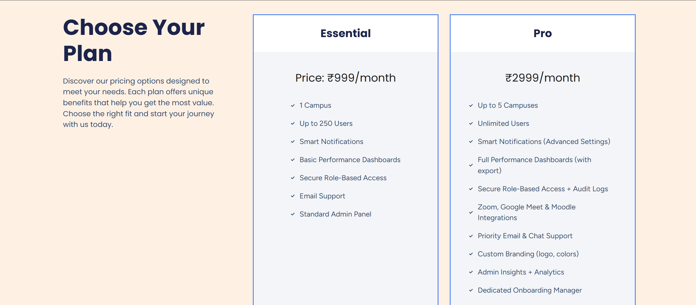

# 🎓 rtCamp SaaS Demo Website

A modern, interactive, single-page SaaS showcase for **rtCamp** — built with WordPress + Elementor.

This project includes:
- A visually engaging one-pager
- Clean section-based layout
- Reusable Elementor components
- Exportable `.wpress` file for quick restore

---

## 🔑 Key Features

- 🧠 **Smart Notifications** – Real-time department-level updates  
- 🔐 **Secure Access** – Role-based permissions for user control  
- 📈 **Dashboards** – Insights for students, teachers, and admins  
- 🤝 **Integrations** – Zoom, Google Meet, Moodle ready  
- 🎯 **Responsive Design** – Mobile-ready and modern UI  
- ⚡ **Built with Elementor** – Easy to modify and extend

## 📽️ Demo Video

[](https://www.youtube.com/watch?v=bF-EFuRZyx4)





---

## ⚙️ Installation Guide

### 🧩 Requirements:
- WordPress (self-hosted)
- All-in-One WP Migration plugin

### 📦 Steps:

1. Download the `.wpress` backup file from this repo  
2. Log into your WordPress admin panel  
3. Install & activate **All-in-One WP Migration** plugin  
4. Go to **All-in-One WP Migration → Import**  
5. Upload `rtcamp-site.wpress` and proceed with restore  
6. Log in again with your old site's credentials

---

## 🧪 How to Use

After importing:

- Edit sections via **Elementor**
- Update images, links, or animations as needed
- Customize styles under **Appearance → Customize**

---

## 📥 Download

👉 [Download the `.wpress` backup file (Google Drive)](https://drive.google.com/file/d/1-x-UEHZBTiGoSmHvoggzY4FSAYaJi7GH/view?usp=sharing)

> 📦 Use this with the All-in-One WP Migration plugin to restore the full WordPress site.

> Or clone the repo:
```bash
git clone https://github.com/your-username/rtcamp-saas-showcase.git
